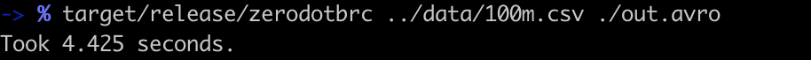

# 0.1BRC Challenge Polars
> A slightly modified version of 1BRC, and 1/10th the size

As my first small project with Polars-rs, I decided to take a swing at the 1 Billion Row Challenge.

The 1BRC, created by Gunnar Morling, was originally a Java performance competition to process a 1 billion row CSV file. [\[1\]](https://github.com/gunnarmorling/1brc)

The test bed for the competition was a Hetzner AX161 dedicated server with 32 code AMD Ryzen 7 and 128GB of ram.

However, as I'm running this on a MacBook M1 Pro with 10 cores and 16GB of ram, I've scaled down to a 100M row version.

I've modified the original requirements to output to STDOUT and instead write to an Apache Avro file.

<div>
    
</div>

not too shabby, eh?

## Installation

Download the latest release to your path.

## Usage example

`./zerodotbrc [infile] [outfile]`

## Development setup

```sh
git clone https://github.com/pipertownley/zerodotbrc
cd zerodotbrc
```

```sh
cargo build --release
cp target/release/zerodotbrc /usr/local/bin
```

## Release History

* 0.1.0
    * The first release

## Meta

Your Name – [@YourTwitter](https://twitter.com/dbader_org) – YourEmail@example.com

Distributed under the XYZ license. See ``LICENSE`` for more information.

[https://github.com/yourname/github-link](https://github.com/dbader/)

## Contributing

1. Fork it (<https://github.com/yourname/yourproject/fork>)
2. Create your feature branch (`git checkout -b feature/fooBar`)
3. Commit your changes (`git commit -am 'Add some fooBar'`)
4. Push to the branch (`git push origin feature/fooBar`)
5. Create a new Pull Request

<!-- Markdown link & img dfn's -->
[npm-image]: https://img.shields.io/npm/v/datadog-metrics.svg?style=flat-square
[npm-url]: https://npmjs.org/package/datadog-metrics
[npm-downloads]: https://img.shields.io/npm/dm/datadog-metrics.svg?style=flat-square
[travis-image]: https://img.shields.io/travis/dbader/node-datadog-metrics/master.svg?style=flat-square
[travis-url]: https://travis-ci.org/dbader/node-datadog-metrics
[wiki]: https://github.com/yourname/yourproject/wiki
